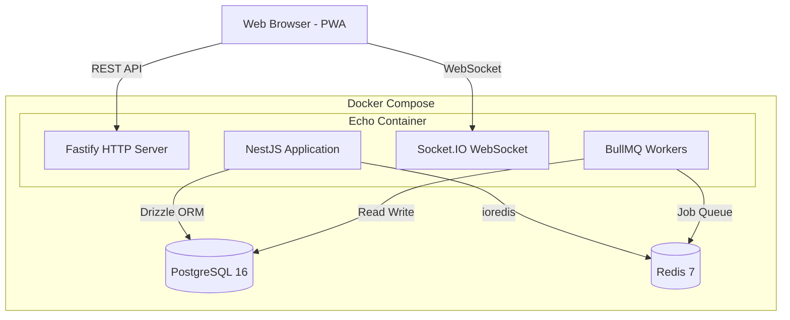
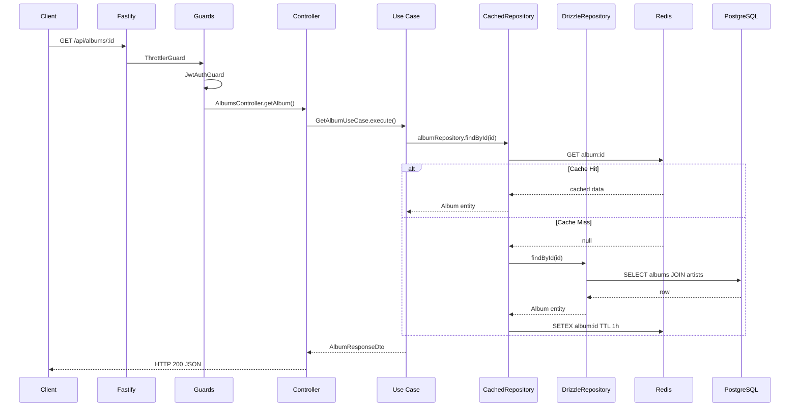
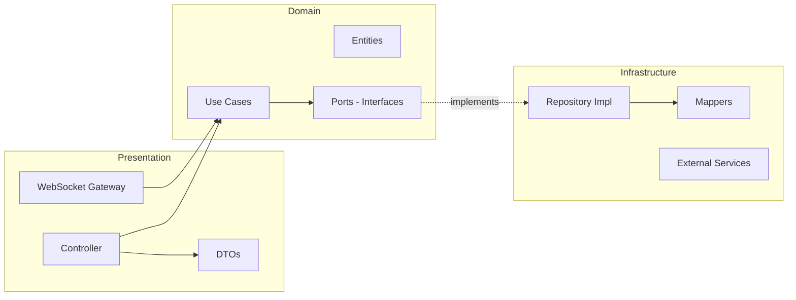
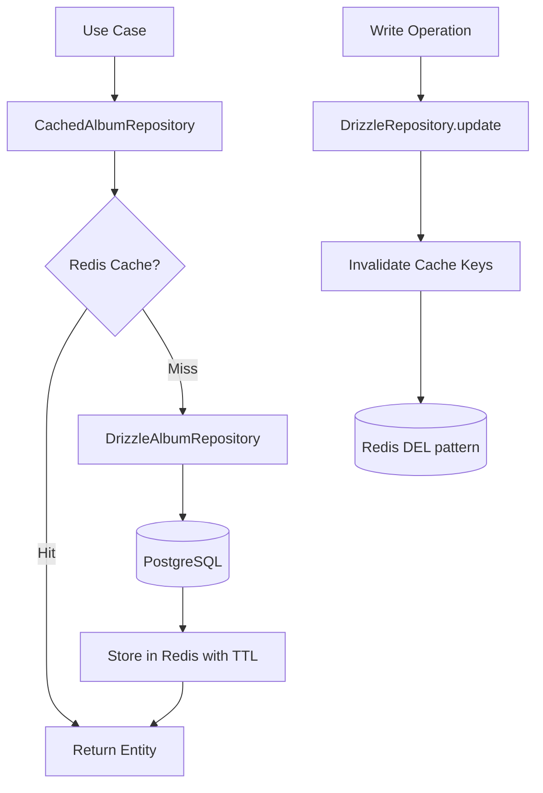
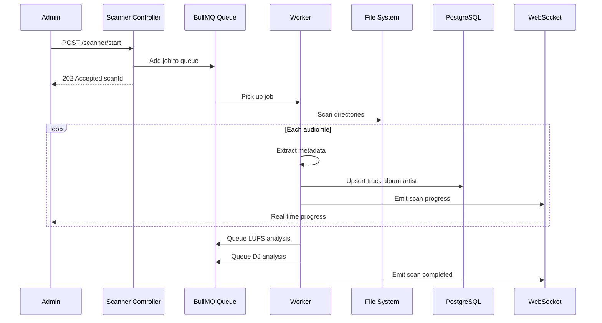
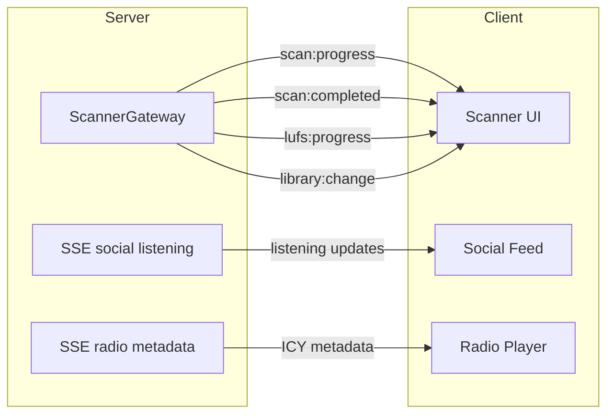
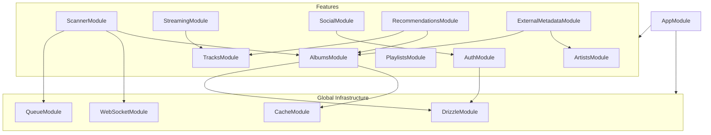
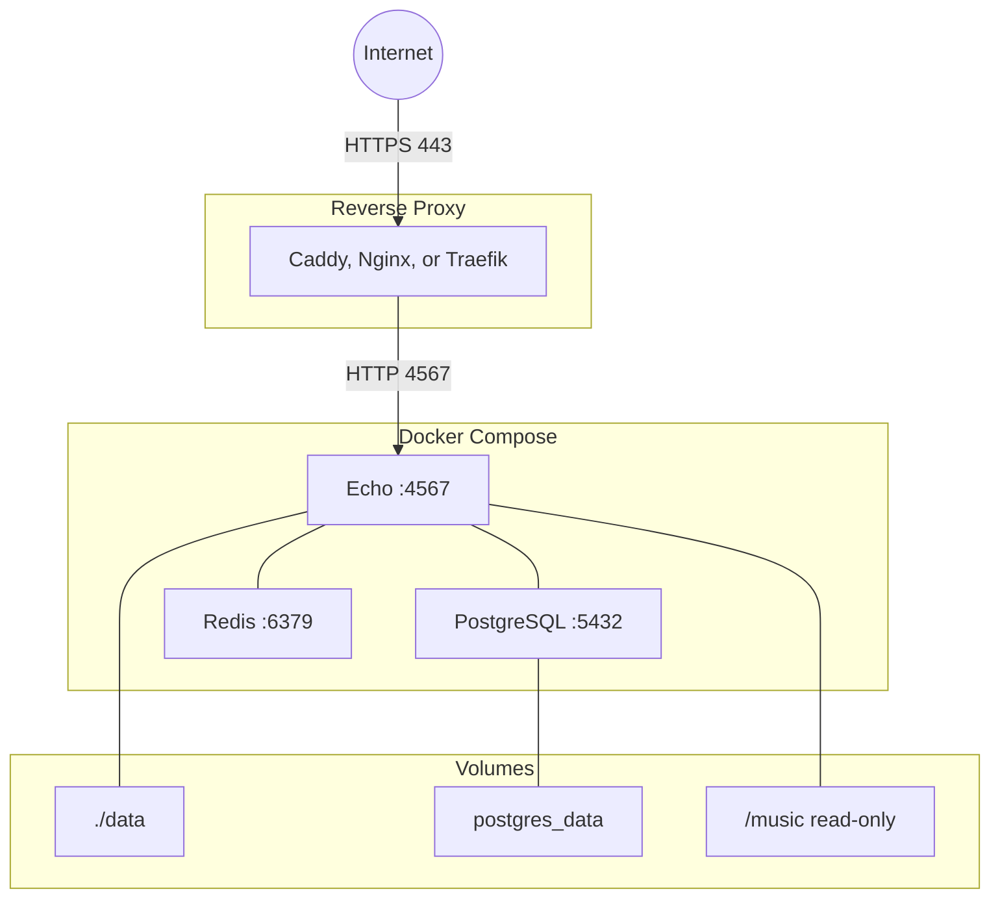

# Architecture

## System Overview

## Request Flow

How an API request flows through the hexagonal architecture:

## Hexagonal Architecture

Each feature module follows domain-driven layers:

**Example with Albums:**

| Layer | Class | File |
|-------|-------|------|
| Controller | `AlbumsController` | `albums/presentation/controller/` |
| Use Case | `GetAlbumUseCase` | `albums/domain/use-cases/get-album/` |
| Port | `IAlbumRepository` | `albums/domain/ports/` |
| Repository | `DrizzleAlbumRepository` | `albums/infrastructure/persistence/` |
| Cache Decorator | `CachedAlbumRepository` | `albums/infrastructure/persistence/` |
| Mapper | `AlbumMapper` | `albums/infrastructure/persistence/` |

## Caching Strategy

Cache-aside pattern with Redis:

**TTLs:**

| Data | TTL | Reason |
|------|-----|--------|
| Single entity (album, artist) | 1 hour | Rarely changes |
| Search results | 1 min | Must stay fresh |
| Counts | 30 min | Approximate is fine |
| Recent and top played | 5 min | Changes with user activity |

## Background Jobs

Library scanning and analysis run asynchronously via BullMQ:

**Job queues:**

| Queue | Job | Concurrency |
|-------|-----|-------------|
| `library-scan` | Full library scan | 1 |
| `scanner` | Incremental scan (file watcher) | 1 |
| `lufs-analysis` | Loudness normalization | 1 |
| `dj-analysis` | Smart playlist scoring | 1 |

## WebSocket Events

Real-time communication via Socket.IO:

## Module Dependency Graph

## Deployment

