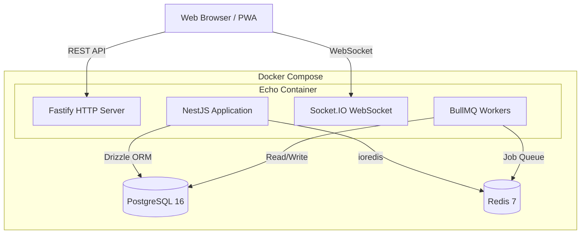
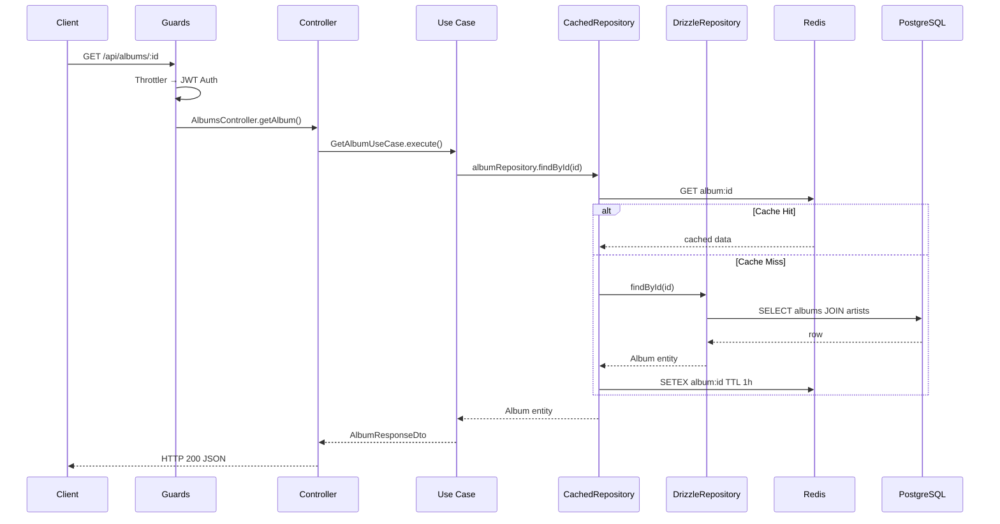
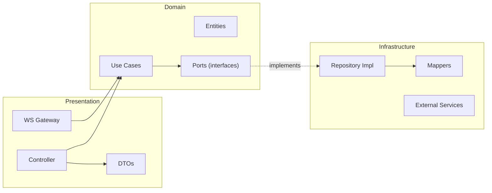
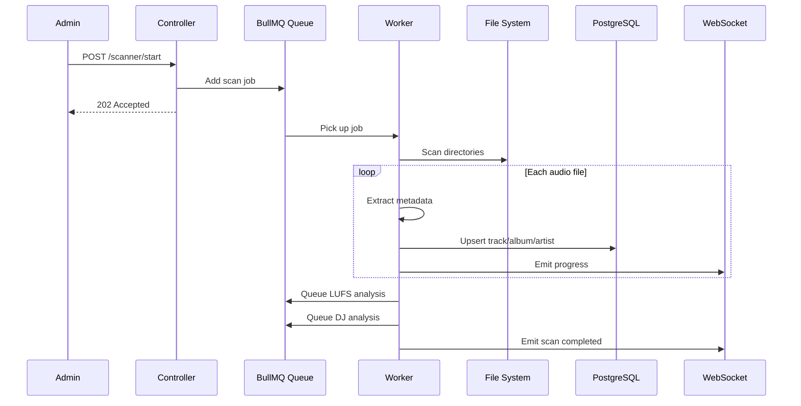
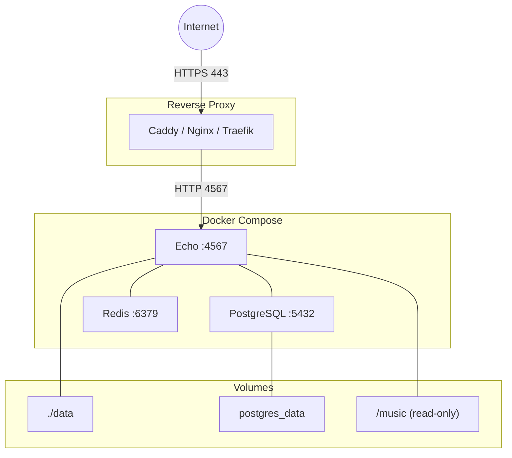

# Architecture

## System Overview

```mermaid
graph TB
    Client["Web Browser / PWA"]

    subgraph Docker["Docker Compose"]
        subgraph Echo["Echo Container"]
            Fastify["Fastify HTTP Server"]
            NestJS["NestJS Application"]
            WSock["Socket.IO WebSocket"]
            BullWorker["BullMQ Workers"]
        end
        PG[("PostgreSQL 16")]
        RD[("Redis 7")]
    end

    Client -->|REST API| Fastify
    Client -->|WebSocket| WSock
    NestJS -->|Drizzle ORM| PG
    NestJS -->|ioredis| RD
    BullWorker -->|Job Queue| RD
    BullWorker -->|Read/Write| PG
```

## Request Flow

How an API request flows through the hexagonal architecture:

```mermaid
sequenceDiagram
    participant C as Client
    participant G as Guards
    participant CT as Controller
    participant UC as Use Case
    participant CR as CachedRepository
    participant DR as DrizzleRepository
    participant RD as Redis
    participant DB as PostgreSQL

    C->>G: GET /api/albums/:id
    G->>G: Throttler → JWT Auth
    G->>CT: AlbumsController.getAlbum()
    CT->>UC: GetAlbumUseCase.execute()
    UC->>CR: albumRepository.findById(id)

    CR->>RD: GET album:id
    alt Cache Hit
        RD-->>CR: cached data
    else Cache Miss
        CR->>DR: findById(id)
        DR->>DB: SELECT albums JOIN artists
        DB-->>DR: row
        DR-->>CR: Album entity
        CR->>RD: SETEX album:id TTL 1h
    end

    CR-->>UC: Album entity
    UC-->>CT: AlbumResponseDto
    CT-->>C: HTTP 200 JSON
```

## Hexagonal Architecture

Each feature module follows domain-driven layers:

```mermaid
graph LR
    subgraph P["Presentation"]
        Controller["Controller"]
        DTO["DTOs"]
        Gateway["WS Gateway"]
    end

    subgraph D["Domain"]
        UseCase["Use Cases"]
        Entity["Entities"]
        Port["Ports (interfaces)"]
    end

    subgraph I["Infrastructure"]
        Repo["Repository Impl"]
        Mapper["Mappers"]
        ExtService["External Services"]
    end

    Controller --> UseCase
    UseCase --> Port
    Port -.->|implements| Repo
    Repo --> Mapper
    Gateway --> UseCase
    Controller --> DTO
```

**Example — Albums module:**

| Layer      | Class                    | Path                                 |
| ---------- | ------------------------ | ------------------------------------ |
| Controller | `AlbumsController`       | `albums/presentation/controller/`    |
| Use Case   | `GetAlbumUseCase`        | `albums/domain/use-cases/get-album/` |
| Port       | `IAlbumRepository`       | `albums/domain/ports/`               |
| Repository | `DrizzleAlbumRepository` | `albums/infrastructure/persistence/` |
| Cache      | `CachedAlbumRepository`  | `albums/infrastructure/persistence/` |
| Mapper     | `AlbumMapper`            | `albums/infrastructure/persistence/` |

## Caching Strategy

Cache-aside pattern with Redis. Reads check cache first; writes invalidate related keys.

| Data                    | TTL       | Reason                     |
| ----------------------- | --------- | -------------------------- |
| Album / Track           | 1 hour    | Rarely changes             |
| Artist                  | 2 hours   | Even less frequent changes |
| Search results          | 1 min     | Must stay fresh            |
| Counts                  | 30 min    | Approximate is fine        |
| Recent played           | 5 min     | Changes with user activity |
| Most played / Top items | 10–15 min | Moderate refresh           |
| Play stats              | 10 min    | User-specific aggregates   |

## Background Jobs

Library scanning and audio analysis run asynchronously via BullMQ:

```mermaid
sequenceDiagram
    participant Admin
    participant API as Controller
    participant Q as BullMQ Queue
    participant W as Worker
    participant FS as File System
    participant DB as PostgreSQL
    participant WS as WebSocket

    Admin->>API: POST /scanner/start
    API->>Q: Add scan job
    API-->>Admin: 202 Accepted

    Q->>W: Pick up job
    W->>FS: Scan directories
    loop Each audio file
        W->>W: Extract metadata
        W->>DB: Upsert track/album/artist
        W->>WS: Emit progress
    end
    W->>Q: Queue LUFS analysis
    W->>Q: Queue DJ analysis
    W->>WS: Emit scan completed
```

| Queue           | Purpose                              | Concurrency |
| --------------- | ------------------------------------ | ----------- |
| `library-scan`  | Full library scan                    | 1           |
| `scanner`       | Incremental scan (file watcher)      | 1           |
| `lufs-analysis` | Loudness normalization (Essentia.js) | 1           |
| `dj-analysis`   | Audio features for smart playlists   | 1           |

## Real-Time Events

| Transport | Events                                                               | Used by          |
| --------- | -------------------------------------------------------------------- | ---------------- |
| Socket.IO | `scan:progress`, `scan:completed`, `lufs:progress`, `library:change` | Scanner UI       |
| SSE       | Listening now updates                                                | Social feed      |
| SSE       | ICY metadata                                                         | Radio player     |
| SSE       | Federation sync progress                                             | Federation panel |

## Deployment

```mermaid
graph TB
    Internet(("Internet"))

    subgraph RP["Reverse Proxy"]
        Proxy["Caddy / Nginx / Traefik"]
    end

    subgraph DC["Docker Compose"]
        Echo["Echo :4567"]
        PG["PostgreSQL :5432"]
        Redis["Redis :6379"]
    end

    subgraph Vol["Volumes"]
        Data["./data"]
        PGData["postgres_data"]
        Music["/music (read-only)"]
    end

    Internet -->|HTTPS 443| Proxy
    Proxy -->|HTTP 4567| Echo
    Echo --- PG
    Echo --- Redis
    Echo --- Data
    PG --- PGData
    Echo --- Music
```

See [Reverse Proxy](reverse-proxy.md) for HTTPS setup with Caddy, Nginx, Traefik, or Cloudflare Tunnel.
