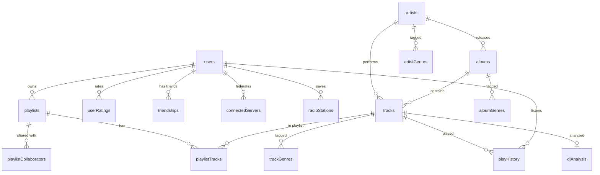

# Database

Echo uses PostgreSQL 16 with [Drizzle ORM](https://orm.drizzle.team/). Schema files live in `api/src/infrastructure/database/schema/`.

## Entity Relationship

Core entities and their main relationships:



## Tables

### Music Library

| Table                  | Purpose                                                   | Key Relations                       |
| ---------------------- | --------------------------------------------------------- | ----------------------------------- |
| `artists`              | Artist metadata, MusicBrainz IDs, profile images          | Referenced by albums, tracks        |
| `albums`               | Album metadata, cover art, stable PIDs                    | FK to artists (albumArtist, artist) |
| `tracks`               | Individual tracks with file path, duration, audio tags    | FK to albums, artists               |
| `track_artists`        | Many-to-many: tracks with multiple artists                | FK to tracks, artists               |
| `genres`               | Genre tags                                                | —                                   |
| `artist_genres`        | Many-to-many: artists with genres                         | FK to artists, genres               |
| `album_genres`         | Many-to-many: albums with genres                          | FK to albums, genres                |
| `track_genres`         | Many-to-many: tracks with genres                          | FK to tracks, genres                |
| `custom_album_covers`  | User-uploaded album covers                                | FK to albums                        |
| `custom_artist_images` | User-uploaded artist images (profile, background, banner) | FK to artists                       |

### Users & Social

| Table                    | Purpose                                       | Key Relations                      |
| ------------------------ | --------------------------------------------- | ---------------------------------- |
| `users`                  | Accounts, auth, profile settings, preferences | Parent for most user data          |
| `friendships`            | Friend requests (pending/accepted/blocked)    | FK to users (requester, addressee) |
| `playlists`              | User playlists with metadata                  | FK to users (owner)                |
| `playlist_tracks`        | Tracks in a playlist with ordering            | FK to playlists, tracks            |
| `playlist_collaborators` | Shared playlist access                        | FK to playlists, users             |
| `shares`                 | Shared resources (albums, playlists, tracks)  | FK to users                        |
| `bookmarks`              | User bookmarks for media items                | FK to users                        |

### Play Tracking

| Table                | Purpose                                                  | Key Relations            |
| -------------------- | -------------------------------------------------------- | ------------------------ |
| `play_history`       | Individual play events with context and completion rate  | FK to users, tracks      |
| `user_play_stats`    | Aggregated play counts (polymorphic: track/album/artist) | FK to users              |
| `user_ratings`       | Star ratings (polymorphic: track/album/artist)           | FK to users              |
| `play_queue`         | Current playback state and "listening now" info          | FK to users, tracks      |
| `play_queue_tracks`  | Tracks in the play queue with ordering                   | FK to play_queue, tracks |
| `listening_sessions` | Collaborative listening sessions                         | FK to users              |

### Audio Analysis

| Table         | Purpose                                                | Key Relations      |
| ------------- | ------------------------------------------------------ | ------------------ |
| `dj_analysis` | BPM, key, energy, danceability per track (Essentia.js) | FK to tracks (1:1) |

### Federation

| Table                      | Purpose                                          | Key Relations                  |
| -------------------------- | ------------------------------------------------ | ------------------------------ |
| `connected_servers`        | Remote Echo servers a user has linked            | FK to users                    |
| `federation_tokens`        | Invitation tokens for server pairing             | FK to users                    |
| `federation_access_tokens` | Auth tokens for remote API access                | FK to users                    |
| `album_import_queue`       | Queue for downloading albums from remote servers | FK to users, connected_servers |

### Metadata & Enrichment

| Table                | Purpose                                         | Key Relations               |
| -------------------- | ----------------------------------------------- | --------------------------- |
| `metadata_cache`     | Cached metadata fetched from external providers | —                           |
| `mbid_search_cache`  | Cached MusicBrainz ID lookups                   | —                           |
| `metadata_conflicts` | Tracks metadata conflicts for resolution        | FK to tracks/albums/artists |
| `enrichment_logs`    | Logs of enrichment operations                   | —                           |

### System

| Table                      | Purpose                                     |
| -------------------------- | ------------------------------------------- |
| `radio_stations`           | Saved internet radio stations (FK to users) |
| `radio_station_images`     | Custom favicons for radio stations          |
| `notifications`            | User notification inbox                     |
| `notification_preferences` | Per-user notification type settings         |
| `stream_tokens`            | Short-lived tokens for audio streaming auth |
| `settings`                 | Global application settings                 |
| `library_scans`            | Scan status and results                     |
| `players`                  | Registered player clients                   |

## Migrations

Migrations live in `api/drizzle/` and are managed by Drizzle Kit:

```bash
cd api
pnpm db:generate    # Generate migration from schema changes
pnpm db:migrate     # Apply pending migrations
pnpm db:studio      # Browse data with Drizzle Studio
```

See [Development](development.md) for more details.
