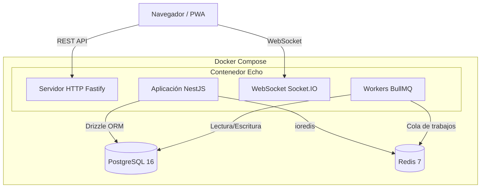
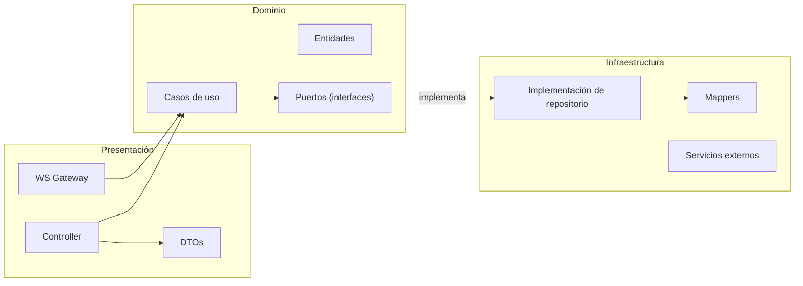
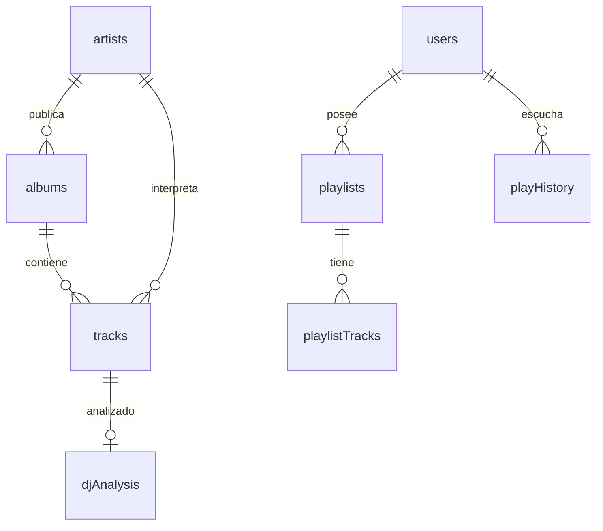

# Echo — Servidor de streaming musical self-hosted

## Documento de defensa del Proyecto Final (TFG — DAW)

> Documento de apoyo para la exposición oral. Reúne la visión global del proyecto,
> las decisiones técnicas, los módulos clave con referencias al código real y un
> anexo de preguntas frecuentes del tribunal con respuestas preparadas.

---

## Índice

1. [Resumen ejecutivo (elevator pitch)](#1-resumen-ejecutivo-elevator-pitch)
2. [Motivación y problema que resuelve](#2-motivación-y-problema-que-resuelve)
3. [Objetivos del proyecto](#3-objetivos-del-proyecto)
4. [Visión general y dimensión del proyecto](#4-visión-general-y-dimensión-del-proyecto)
5. [Stack tecnológico y justificación](#5-stack-tecnológico-y-justificación)
6. [Arquitectura del sistema](#6-arquitectura-del-sistema)
7. [Arquitectura hexagonal explicada con código](#7-arquitectura-hexagonal-explicada-con-código)
8. [Modelo de datos](#8-modelo-de-datos)
9. [Módulos y funcionalidades destacadas](#9-módulos-y-funcionalidades-destacadas)
10. [Seguridad](#10-seguridad)
11. [Rendimiento, caché y procesamiento asíncrono](#11-rendimiento-caché-y-procesamiento-asíncrono)
12. [Frontend](#12-frontend)
13. [Calidad: testing, CI/CD y herramientas](#13-calidad-testing-cicd-y-herramientas)
14. [Despliegue e infraestructura](#14-despliegue-e-infraestructura)
15. [Dificultades encontradas y soluciones](#15-dificultades-encontradas-y-soluciones)
16. [Conclusiones y líneas futuras](#16-conclusiones-y-líneas-futuras)
17. [Anexo A — Glosario rápido](#anexo-a--glosario-rápido)
18. [Anexo B — Preguntas del tribunal y respuestas](#anexo-b--preguntas-del-tribunal-y-respuestas)
19. [Anexo C — Guion cronometrado de la exposición](#anexo-c--guion-cronometrado-de-la-exposición)

---

## 1. Resumen ejecutivo (elevator pitch)

**Echo es un servidor personal de música que el usuario aloja en su propia máquina
(self-hosted).** Apuntas Echo a tu carpeta de música y puedes escucharla en streaming
desde cualquier dispositivo a través de una interfaz web moderna, sin depender de
servicios como Spotify.

Lo que lo diferencia de otros servidores parecidos (Navidrome, Jellyfin) es que es
**social y conectado**:

- Comparte tu actividad de escucha con amigos.
- **Federación**: conecta varios servidores Echo entre sí y reproduce música del
  servidor de otra persona.
- **Listas inteligentes**: algoritmos de recomendación que redescubren joyas
  olvidadas de tu propia biblioteca (Wave Mix, Daily Mix).
- **Modo DJ**: mezcla automática de canciones analizando tempo (BPM) y tonalidad
  musical con compatibilidad armónica.

En una frase: *"Es tu propio Spotify, que vive en tu casa, que respeta tu privacidad
y que además es social."*

---

## 2. Motivación y problema que resuelve

- **Propiedad de la música**: los servicios de streaming comerciales no te dan
  control sobre tu biblioteca; las canciones aparecen y desaparecen según licencias.
- **Privacidad**: tus hábitos de escucha no se venden a terceros; todo vive en tu
  servidor.
- **Colecciones personales**: mucha gente tiene archivos FLAC/MP3 (compras, rips,
  música rara) que ningún servicio comercial ofrece.
- **Carencia social en lo self-hosted**: las alternativas existentes son funcionales
  pero "frías" — no permiten compartir ni conectar instancias. Echo cubre ese hueco.

---

## 3. Objetivos del proyecto

**Objetivo general:** desarrollar una aplicación web completa, de calidad de
producción, que permita gestionar y reproducir en streaming una biblioteca musical
propia, con funcionalidades sociales y de descubrimiento.

**Objetivos específicos:**

1. Indexar automáticamente bibliotecas musicales de gran tamaño (escaneo de archivos).
2. Reproducir audio en streaming eficiente (peticiones por rango HTTP).
3. Enriquecer metadatos desde fuentes externas (carátulas, biografías, géneros).
4. Implementar recomendaciones algorítmicas y listas inteligentes.
5. Permitir multiusuario con roles, autenticación segura y preferencias.
6. Ofrecer una interfaz web moderna, instalable como PWA y multiidioma.
7. Empaquetar todo para un despliegue sencillo con Docker.

---

## 4. Visión general y dimensión del proyecto

Es importante transmitir al tribunal la **escala real** del proyecto:

| Métrica                       | Valor aproximado                       |
| ----------------------------- | -------------------------------------- |
| Líneas de código backend      | ~127.000 (TypeScript)                  |
| Líneas de código frontend     | ~95.000 (TypeScript/TSX)               |
| Archivos backend              | ~1.120                                 |
| Archivos frontend             | ~750                                   |
| Módulos de dominio (backend)  | 25                                     |
| Módulos de feature (frontend) | 18                                     |
| Archivos de test              | 374                                    |
| Idiomas soportados            | 3 (inglés, español, francés) — 1.733 claves cada uno |
| Versión actual                | 1.1.0                                  |

Es un **monorepo** gestionado con **pnpm workspaces**: un único repositorio con dos
paquetes (`api/` y `web/`) que comparten configuración, scripts y flujo de trabajo.

```
echo/
├── api/            # Backend NestJS (Arquitectura Hexagonal)
│   └── src/
│       ├── features/         # 25 módulos de dominio
│       ├── infrastructure/   # BD, caché, colas, websockets
│       └── shared/           # Guards, decoradores, utilidades
├── web/            # Frontend React
│   └── src/
│       ├── features/         # 18 módulos de feature
│       ├── shared/           # Componentes, hooks, store
│       └── app/              # Enrutado y providers
├── docs/           # Documentación de usuario
├── nginx/          # Configuración del proxy inverso
└── scripts/        # Scripts de instalación y utilidades
```

> **Mensaje para el tribunal:** no es un CRUD de prácticas. Es una aplicación con
> arquitectura de producción, procesamiento asíncrono, análisis de audio, tiempo real
> y despliegue containerizado.

---

## 5. Stack tecnológico y justificación

| Capa         | Tecnologías                                                 |
| ------------ | ----------------------------------------------------------- |
| **Backend**  | NestJS, Fastify, Drizzle ORM, PostgreSQL 16, Redis 7, BullMQ |
| **Frontend** | React 18, Vite, TypeScript, Zustand, TanStack Query, Wouter  |
| **Infra**    | Docker, Nginx, GitHub Actions, pnpm workspaces               |

### Por qué cada elección (justificación que el tribunal valora)

- **NestJS**: framework backend con arquitectura modular e inyección de dependencias
  de serie. Facilita aplicar arquitectura hexagonal y mantener el código organizado a
  gran escala. Está basado en TypeScript, lo que da tipado fuerte de extremo a extremo.
- **Fastify** (en vez de Express): servidor HTTP más rápido y con menor overhead.
  NestJS lo soporta como adaptador. Mejora el rendimiento del streaming.
- **Drizzle ORM**: ORM moderno, ligero y *type-safe*. Las consultas se escriben en
  TypeScript y los tipos se infieren del esquema; los errores de columnas/tablas se
  detectan en tiempo de compilación. Incluye su propio sistema de migraciones.
- **PostgreSQL 16**: base de datos relacional robusta, ideal para el modelo de datos
  con muchas relaciones (artistas, álbumes, canciones, géneros, playlists, social).
- **Redis 7**: caché en memoria (patrón cache-aside) y *backend* para las colas de
  trabajos. Reduce drásticamente la carga sobre PostgreSQL.
- **BullMQ**: sistema de colas sobre Redis para procesamiento asíncrono (escaneo de
  biblioteca, análisis de audio) sin bloquear las peticiones HTTP.
- **React 18 + Vite**: frontend SPA moderno con HMR (recarga en caliente) muy rápida.
- **Zustand**: gestión de estado global ligera (player, cola de reproducción) sin el
  boilerplate de Redux.
- **TanStack Query**: gestión de estado de servidor (caché de peticiones, refetch,
  invalidación). Separa claramente el estado de cliente del estado de servidor.
- **Wouter**: router minimalista (alternativa ligera a React Router).
- **Docker + Docker Compose**: empaquetado reproducible. El usuario final levanta
  toda la pila (app + PostgreSQL + Redis) con un solo comando.

---

## 6. Arquitectura del sistema

### Visión de alto nivel

El sistema corre como un conjunto de contenedores orquestados por Docker Compose:

- **Contenedor Echo**: servidor HTTP Fastify + aplicación NestJS + servidor WebSocket
  (Socket.IO) + workers de BullMQ, todo en el mismo proceso Node.
- **PostgreSQL 16**: persistencia.
- **Redis 7**: caché y cola de trabajos.

El navegador (o la PWA) habla con el backend por dos vías:

1. **REST API** sobre HTTP (peticiones normales).
2. **WebSocket** para eventos en tiempo real (progreso de escaneo, actividad social,
   metadatos de radio en directo).



### Flujo de una petición (con caché)

Cuando llega `GET /api/albums/:id`:

1. Pasa por los **Guards** (throttler de rate-limit → autenticación JWT).
2. El **Controller** delega en el **Use Case**.
3. El Use Case pide el dato al repositorio. La implementación cacheada
   (`CachedAlbumRepository`) consulta primero Redis.
4. **Cache hit** → devuelve el dato cacheado. **Cache miss** → consulta PostgreSQL,
   guarda en Redis con TTL y lo devuelve.

Esto es el **patrón cache-aside**: el código de dominio no sabe que existe caché; es
una decoración transparente sobre el repositorio real.

---

## 7. Arquitectura hexagonal explicada con código

**Esta es la sección más importante para la defensa técnica.** Demuestra que el
proyecto no es código espagueti, sino que aplica principios de diseño profesionales.

### Concepto

La **arquitectura hexagonal** (o "puertos y adaptadores") separa el código en capas
con una regla de oro: **el dominio no depende de la infraestructura, sino al revés.**

Cada uno de los 25 módulos sigue la misma estructura de tres capas:



| Capa           | Responsabilidad                                                       |
| -------------- | --------------------------------------------------------------------- |
| Presentación   | Recibe peticiones HTTP/WS, valida entrada (DTOs), devuelve respuestas. |
| Dominio        | Lógica de negocio pura. Entidades, casos de uso y **puertos** (interfaces). No conoce ni la BD ni HTTP. |
| Infraestructura | Implementa los puertos: acceso a BD (Drizzle), APIs externas, caché. |

### Ejemplo real — módulo `albums`

```
albums/
├── presentation/
│   ├── controller/albums.controller.ts
│   └── dtos/album.response.dto.ts
├── domain/
│   ├── entities/album.entity.ts
│   ├── ports/album-repository.port.ts        ← interfaz (puerto)
│   └── use-cases/get-album/get-album.use-case.ts
└── infrastructure/
    └── persistence/
        ├── album.repository.ts                ← implementación Drizzle
        ├── cached-album.repository.ts         ← decorador de caché
        └── album.mapper.ts                    ← traduce fila BD ↔ entidad
```

**1. La entidad de dominio** (`album.entity.ts`) — un objeto de negocio puro, sin
dependencias de framework. Encapsula sus datos (`props` privado) y los expone con
getters; tiene fábricas `create()` (nueva) y `reconstruct()` (desde BD):

```typescript
export class Album {
  private props: AlbumProps;

  constructor(props: AlbumProps) {
    this.props = props;
  }

  static create(props: Omit<AlbumProps, 'id' | 'createdAt' | 'updatedAt'>): Album {
    return new Album({ ...props, id: generateUuid(), createdAt: new Date(), updatedAt: new Date() });
  }

  static reconstruct(props: AlbumProps): Album { return new Album(props); }

  get id(): string { return this.props.id; }
  get name(): string { return this.props.name; }
  // ... resto de getters
  toPrimitives(): AlbumProps { return { ...this.props }; }
}
```

**2. El puerto** (`album-repository.port.ts`) — una interfaz que define *qué* se puede
hacer, sin decir *cómo*. El dominio depende de esta abstracción:

```typescript
export interface IAlbumRepository {
  findById(id: string): Promise<Album | null>;
  findAll(skip: number, take: number): Promise<Album[]>;
  search(name: string, skip: number, take: number): Promise<Album[]>;
  // ...
  create(album: Album): Promise<Album>;
  update(id: string, album: Partial<Album>): Promise<Album | null>;
  delete(id: string): Promise<boolean>;
}

// Token para la inyección de dependencias de NestJS
export const ALBUM_REPOSITORY = 'IAlbumRepository';
```

**3. El caso de uso** (`get-album.use-case.ts`) — orquesta la lógica. Recibe el
repositorio **por inyección de dependencias** usando el token, no la clase concreta:

```typescript
@Injectable()
export class GetAlbumUseCase {
  constructor(
    @Inject(ALBUM_REPOSITORY)
    private readonly albumRepository: IAlbumRepository,
  ) {}

  async execute(input: GetAlbumInput): Promise<GetAlbumOutput> {
    if (!input.id || input.id.trim() === '') {
      throw new NotFoundError('Album', 'invalid-id');
    }
    const album = await this.albumRepository.findById(input.id);
    if (!album) {
      throw new NotFoundError('Album', input.id);
    }
    return { id: album.id, name: album.name, /* ... */ };
  }
}
```

### ¿Por qué es importante esto? (lo que debes saber explicar)

- **Testabilidad**: como el caso de uso depende de una interfaz, en los tests puedo
  inyectar un repositorio "falso" en memoria y probar la lógica sin tocar PostgreSQL.
  Por eso hay 374 archivos de test.
- **Intercambiabilidad**: la caché es un decorador (`CachedAlbumRepository`) que
  implementa la misma interfaz que el repositorio real. Puedo activar o quitar caché
  sin tocar el dominio.
- **Mantenibilidad a escala**: con 25 módulos siguiendo el mismo patrón, cualquier
  desarrollador sabe dónde está cada cosa.

---

## 8. Modelo de datos

PostgreSQL 16 con Drizzle ORM. El esquema vive en
`api/src/infrastructure/database/schema/` y las migraciones en `api/drizzle/`.

### Grupos de tablas

- **Biblioteca musical**: `artists`, `albums`, `tracks`, `track_artists`, `genres` y
  las tablas N:M `artist_genres`, `album_genres`, `track_genres`. Más covers/imágenes
  personalizadas (`custom_album_covers`, `custom_artist_images`).
- **Usuarios y social**: `users`, `friendships`, `playlists`, `playlist_tracks`,
  `playlist_collaborators`, `shares`, `bookmarks`.
- **Seguimiento de reproducción**: `play_history` (cada evento de escucha con tasa de
  finalización), `user_play_stats` (contadores agregados polimórficos:
  track/album/artist), `user_ratings`, `play_queue`, `play_queue_tracks`,
  `listening_sessions`.
- **Análisis de audio**: `dj_analysis` (BPM, tonalidad, energía, bailabilidad; 1:1 con
  track).
- **Federación**: `connected_servers`, `federation_tokens`,
  `federation_access_tokens`, `album_import_queue`.
- **Metadatos**: `metadata_cache`, `mbid_search_cache`, `metadata_conflicts`,
  `enrichment_logs`.
- **Sistema**: `radio_stations`, `notifications`, `notification_preferences`,
  `stream_tokens`, `settings`, `library_scans`, `players`.

### Relaciones principales



> **Detalle interesante para mencionar:** las estadísticas y ratings son
> **polimórficos** — una misma tabla guarda valoraciones de canción, álbum o artista
> mediante un campo de tipo + id, evitando duplicar tablas.

---

## 9. Módulos y funcionalidades destacadas

Aquí están las funcionalidades que más impresionan en una defensa. Para cada una:
qué hace, cómo funciona y qué decisión técnica destacar.

### 9.1 Escáner de biblioteca (`scanner`)

Indexa automáticamente la carpeta de música del usuario.

- **Descubrimiento de archivos**: recorrido recursivo con detección de enlaces
  simbólicos y bucles (control de profundidad máxima e inodos visitados), filtrando
  por extensiones de audio soportadas (MP3, FLAC, AAC, OGG, WAV…).
- **Extracción de metadatos**: usa **FFprobe** y la librería `music-metadata` para
  leer duración, bitrate, códec y tags (título, artista, álbum, año, género…).
- **Procesado**: crea/actualiza en BD las entidades track/álbum/artista/género,
  resolviendo relaciones.
- **Escaneo incremental + vigilancia**: un *file watcher* basado en **chokidar**
  detecta altas/cambios/bajas con *debounce* de 5s (evita reprocesar en ediciones
  rápidas). Configurable por base de datos.
- **Asíncrono**: el escaneo corre en una **cola BullMQ** (concurrencia 1) y emite
  progreso por WebSocket. Al terminar, encola análisis de audio (LUFS y DJ).

**Decisión destacable:** resolución de enlaces simbólicos para evitar bucles infinitos
y *debounce* del watcher para no machacar el sistema en ediciones rápidas.

### 9.2 Streaming de audio (`streaming`)

- Soporta **peticiones por rango HTTP** (cabecera `Range: bytes=...`), devolviendo
  `206 Partial Content`. Esto permite **buscar dentro de la canción** sin descargarla
  entera y reanudar reproducción.
- **Autenticación por stream token**: un token corto y de un solo uso por usuario,
  almacenado **hasheado** (SHA-256) en BD y validado contra caché (TTL 1h). Así la URL
  de audio no expone el JWT.
- Gestión del ciclo de vida del stream: timeout por inactividad (30s) y limpieza de
  conexiones.

**Decisión destacable:** doble validación de ruta (`validateMusicPath()` + `fs.stat()`)
para evitar *path traversal* (que alguien pida `../../etc/passwd`).

### 9.3 Recomendaciones y listas inteligentes (`recommendations`)

El **Wave Mix** es una lista diaria generada por algoritmo. Para cada canción del
top-200 del usuario calcula una **puntuación ponderada**:

```
score = 0.30·explícito + 0.50·implícito + 0.18·recencia + 0.02·diversidad
```

- **Explícito (0-100)**: valoración del usuario (1-5 estrellas × 20).
- **Implícito (0-100)**: 70% del número de reproducciones (ponderado, tope 70) + 30%
  de la tasa de finalización (cuánto se escucha de media).
- **Recencia (0-100)**: decaimiento exponencial (λ = 0,03/día); lo reciente puntúa más
  pero suave.
- **Diversidad (0-100)**: penaliza la sobre-representación de un mismo artista.

Después aplica un **balance temporal** en la selección: 40% última semana, 30% último
mes, 20% último año, 10% más antiguo. Esto evita el sesgo de "siempre lo mismo" y
**redescubre música olvidada**.

**Decisión destacable (rendimiento):** en lugar de hacer 3 consultas por cada canción
(3×N), **precarga** todas las interacciones, estadísticas y datos de artista en **3
consultas totales** y puntúa en memoria. Es una optimización de O(3N) a O(N).

### 9.4 Modo DJ y análisis de audio (`dj`)

Mezcla canciones automáticamente como un DJ, encadenando temas compatibles.

- **Características de audio** calculadas con **Essentia.js** (librería de análisis de
  audio compilada a WebAssembly): **BPM** (tempo), **tonalidad** (en notación
  Camelot), **energía** y **bailabilidad**.
- **Mezcla armónica (rueda Camelot)**: las tonalidades se mapean a la rueda Camelot
  (12 números × 2 modos = 24). Dos canciones son armónicamente compatibles si están en
  la misma casilla, adyacentes (±1) o en relativa mayor/menor. Se les asigna una
  puntuación de compatibilidad (100 misma tonalidad, 90 adyacente, etc.).
- **Pool de workers**: el análisis es costoso, así que se reparte en un *pool* de
  workers (núcleos ÷ 2, máx. 12). Cada worker se **recicla cada 250 análisis** para
  evitar fugas de memoria del WASM, y hay manejo de timeouts y de workers caídos.
- **Fallback**: si Essentia no está disponible, calcula al menos la energía con FFmpeg
  (`volumedetect`).

**Decisión destacable:** reciclado de workers para controlar la memoria de WebAssembly
y compatibilidad armónica real basada en teoría musical (rueda Camelot, como usan los
DJs profesionales en Rekordbox/Serato).

### 9.5 Federación entre servidores (`federation`)

Permite conectar **dos servidores Echo de personas distintas** y reproducir música del
uno en el otro.

- **Emparejamiento por token de invitación**: el servidor A genera un token legible
  (`XXXX-XXXX-XXXX-XXXX`), de un solo uso y caducidad 7 días, y lo comparte con B.
- B canjea el token; A emite un **access token** con permisos granulares
  (`canBrowse`, `canStream`, `canDownload`).
- Soporta **federación mutua** (confianza bidireccional) con estados
  (none/pending/approved/rejected).
- Validación de access tokens con caché en memoria (TTL 5 min) y actualización de
  `lastUsedAt` en *fire-and-forget* para no penalizar la latencia.

**Decisión destacable:** tokens de invitación de un solo uso (no se pueden compartir
indefinidamente) y permisos granulares por servidor conectado.

### 9.6 Enriquecimiento de metadatos (`external-metadata`)

Completa la biblioteca con datos de fuentes externas:

- **MusicBrainz** (IDs canónicos de artista/álbum), **Last.fm** (biografías,
  popularidad), **Fanart.tv** (imágenes de alta calidad), **Cover Art Archive**
  (carátulas).
- **Patrón agente**: cada fuente es un "agente" con su propia configuración y
  prioridad.
- **Rate limiting (token bucket)** por servicio para respetar sus límites
  (MusicBrainz 1 req/s, Last.fm 5 req/s, Fanart 4 req/s) y no ser baneado.
- **Caché de metadatos y de búsquedas de MBID** para no volver a consultar lo mismo.
- **Búsqueda automática de MBID** con umbral de confianza (0,85) antes de aplicar
  cambios, y **detección de conflictos** para revisión manual.

**Decisión destacable:** rate limiting propio por servicio para ser "buen ciudadano"
con APIs gratuitas, más caché agresiva para minimizar llamadas.

### 9.7 Otras funcionalidades

- **Radio por internet** (`radio`): reproduce emisoras con metadatos ICY en directo
  (qué suena ahora) vía SSE.
- **Social** (`social`): amigos, actividad de escucha en directo, perfiles públicos.
- **Music videos** (`music-videos`): vídeos musicales vinculados a canciones.
- **Explore** (`explore`): descubre álbumes no reproducidos, joyas olvidadas.
- **Notificaciones** (`notifications`): bandeja en tiempo real (WebSocket) con
  preferencias por tipo.
- **Setup wizard** (`setup`): asistente de 3 pasos para el primer arranque (crear
  admin, configurar ruta de música, finalizar).
- **Normalización de volumen (LUFS)**: análisis de sonoridad para que no haya saltos
  de volumen entre canciones.

---

## 10. Seguridad

Punto fuerte y muy preguntado en defensas. Medidas implementadas:

- **Contraseñas**: hash con **bcrypt** (coste 12). Nunca se guardan en claro.
- **Mitigación de timing attacks**: en un login fallido se compara contra un
  `DUMMY_HASH` para que el tiempo de respuesta sea constante y no revele si el usuario
  existe.
- **JWT con par de tokens**: *access token* (24h) y *refresh token* (7d), con secretos
  separados. Incluyen `jti` (JWT ID) para poder revocar.
- **Blacklist de refresh tokens**: al refrescar, el token antiguo se invalida (evita
  *replay*).
- **Roles**: `JwtAuthGuard` protege rutas (respetando el decorador `@Public()`) y
  `AdminGuard` restringe rutas de administración.
- **Stream tokens hasheados**: el token de streaming se guarda como hash SHA-256; el
  valor en claro solo viaja al cliente una vez.
- **Defensa contra path traversal**: doble validación de ruta antes de servir un
  archivo.
- **Rate limiting**: `@nestjs/throttler` en HTTP; contador de ventana fija en WebSocket
  (10 eventos/s por cliente).
- **Cabeceras de seguridad**: `@fastify/helmet`.
- **Validación de entrada**: `class-validator` + DTOs en todas las rutas.

---

## 11. Rendimiento, caché y procesamiento asíncrono

### Caché (patrón cache-aside con Redis)

Las lecturas consultan primero Redis; las escrituras invalidan las claves
relacionadas. TTLs ajustados al tipo de dato:

| Dato                     | TTL       | Motivo                        |
| ------------------------ | --------- | ----------------------------- |
| Álbum / Track            | 1 hora    | Cambian poco                  |
| Artista                  | 2 horas   | Cambian aún menos             |
| Resultados de búsqueda   | 1 min     | Deben estar frescos           |
| Contadores               | 30 min    | Una aproximación vale         |
| Reproducido recientemente | 5 min    | Cambia con la actividad       |

### Colas BullMQ (procesamiento asíncrono)

Las tareas pesadas no bloquean la API; se encolan y procesan en background:

| Cola            | Propósito                            | Concurrencia |
| --------------- | ------------------------------------ | ------------ |
| `library-scan`  | Escaneo completo de biblioteca       | 1            |
| `scanner`       | Escaneo incremental (file watcher)   | 1            |
| `lufs-analysis` | Normalización de sonoridad (Essentia)| dinámica     |
| `dj-analysis`   | Análisis de audio para listas        | dinámica     |

La concurrencia del análisis se adapta a la máquina (núcleos ÷ 2, máx. 12).

### Tiempo real

| Transporte | Eventos                                              | Usado por        |
| ---------- | ---------------------------------------------------- | ---------------- |
| Socket.IO  | `scan:progress`, `scan:completed`, `library:change`  | UI del escáner   |
| SSE        | "Escuchando ahora"                                   | Feed social      |
| SSE        | Metadatos ICY                                        | Player de radio  |

> **Frase de cierre técnica:** "La aplicación está diseñada para que las operaciones
> caras (escaneo, análisis de audio, llamadas a APIs externas) nunca bloqueen la
> experiencia del usuario, gracias a colas, caché y eventos en tiempo real."

---

## 12. Frontend

SPA en **React 18** construida con **Vite**, organizada en **18 módulos de feature**
(home, player, playlists, social, radio, settings, setup…), espejo de los módulos del
backend.

- **Gestión de estado**: separación clara entre
  - *estado de cliente* → **Zustand** (estado del reproductor, cola).
  - *estado de servidor* → **TanStack Query** (caché de peticiones, refetch,
    invalidación, estados de carga/error).
- **Enrutado**: **Wouter** (ligero).
- **Formularios**: `react-hook-form` + validación con `zod`.
- **Tiempo real**: `socket.io-client` para eventos en directo.
- **i18n**: `i18next` con 3 idiomas y 1.733 claves cada uno (100% traducidas).
- **PWA**: instalable como app en cualquier dispositivo.
- **Temas**: modo claro y oscuro.
- **Virtualización**: `@tanstack/react-virtual` para renderizar listas enormes
  (bibliotecas con miles de canciones) sin penalizar el rendimiento.
- **Gráficas**: `recharts` para estadísticas de escucha.

---

## 13. Calidad: testing, CI/CD y herramientas

### Testing

- **374 archivos de test**. Backend con Jest; frontend con **Vitest**.
- Tipos: unitarios (lógica de casos de uso con repos en memoria), integración (con BD
  real) y e2e.
- La arquitectura hexagonal hace los tests **fáciles y rápidos**: el dominio se prueba
  sin infraestructura.

### CI/CD (GitHub Actions)

El workflow `ci.yml` se ejecuta en cada push/PR a `main`:

1. Valida que las migraciones estén registradas (`check-migrations.sh`).
2. Levanta servicios PostgreSQL 16 y Redis 7 como contenedores de servicio.
3. Instala dependencias con pnpm (con caché del store).
4. Ejecuta lint, tests y build.

También hay workflows para **publicar la imagen Docker** (`docker-publish.yml`) y
**probarla** (`docker-test.yml`). La imagen se publica en GHCR (GitHub Container
Registry).

### Herramientas de calidad

- **TypeScript** estricto en todo el monorepo (tipado de extremo a extremo).
- **ESLint** + **Prettier** (formato automático).
- **Husky** + **lint-staged**: *pre-commit hook* que formatea automáticamente el
  código staged antes de cada commit.
- **Lighthouse CI** (`lighthouserc.js`): auditoría automática de rendimiento/PWA del
  frontend.
- **Swagger/OpenAPI**: documentación interactiva de la API autogenerada
  (`/api/docs`). El `swagger.json` del repo tiene >500 KB de especificación.

---

## 14. Despliegue e infraestructura

- **Docker multi-stage**: el `Dockerfile` construye frontend y backend y produce una
  imagen final optimizada.
- **Docker Compose**: orquesta Echo + PostgreSQL + Redis. El usuario solo edita la ruta
  a su música y ejecuta `docker compose up -d`.
- **Volúmenes**: `./data` (datos de la app), `postgres_data` (BD) y `/music` montado en
  **solo lectura** (`:ro`) por seguridad.
- **Proxy inverso**: configuración de **Nginx** incluida; documentación para HTTPS con
  Caddy, Nginx, Traefik o Cloudflare Tunnel.
- **Instalación bare-metal**: script `install.sh` para instalar en Linux sin Docker.
- **Puerto** por defecto: `4567`.

```bash
docker compose up -d              # Arrancar
docker compose logs -f echo       # Ver logs
docker compose pull && docker compose up -d   # Actualizar
```

> **Argumento de calidad:** el proyecto está pensado para que cualquier persona, sin
> conocimientos técnicos profundos, pueda autoalojarlo con un único comando.

---

## 15. Dificultades encontradas y soluciones

(Personaliza con tu experiencia real; estas son las más defendibles.)

| Dificultad                                              | Solución aplicada                                                                 |
| ------------------------------------------------------- | --------------------------------------------------------------------------------- |
| El análisis de audio (Essentia/WASM) consume memoria    | Pool de workers con **reciclado cada 250 análisis** y manejo de timeouts/caídas.  |
| Escaneo de bibliotecas grandes bloqueaba la app         | Mover el trabajo a **colas BullMQ** asíncronas con progreso por WebSocket.        |
| Muchas consultas a BD al puntuar recomendaciones (N+1)  | **Precarga en 3 consultas** y cálculo en memoria.                                 |
| APIs externas con límites de peticiones                 | **Rate limiting token bucket** por servicio + caché de resultados.                |
| Servir audio grande sin descargar todo                  | **Peticiones por rango HTTP** (206 Partial Content).                              |
| Seguridad de las URLs de streaming                      | **Stream tokens hasheados** independientes del JWT.                               |
| Mantener orden y testabilidad con 25 módulos            | **Arquitectura hexagonal** uniforme + inyección de dependencias.                  |

---

## 16. Conclusiones y líneas futuras

**Conclusiones:**

- Se ha construido una aplicación web **completa y de calidad de producción** que
  cumple todos los objetivos: indexado, streaming, enriquecimiento, recomendaciones,
  multiusuario, PWA y despliegue containerizado.
- Se han aplicado **patrones y arquitecturas profesionales** (hexagonal, cache-aside,
  colas, DDD ligero) y un stack moderno y tipado.
- El proyecto destaca por funcionalidades poco comunes en lo self-hosted: **federación,
  modo DJ con análisis de audio y recomendaciones algorítmicas**.

**Líneas futuras:**

- Apps nativas móviles (la PWA ya sienta la base).
- Más fuentes de metadatos y portabilidad de metadatos junto a los archivos.
- Soporte de transcodificación bajo demanda (distintos bitrates por ancho de banda).
- Más algoritmos de descubrimiento y mejoras del modo DJ.
- Escalado horizontal (separar workers del proceso web).

---

## Anexo A — Glosario rápido

- **Self-hosted**: software que el propio usuario aloja en su servidor/máquina.
- **Arquitectura hexagonal / puertos y adaptadores**: estilo que aísla la lógica de
  negocio de la infraestructura mediante interfaces.
- **Puerto**: interfaz que define una capacidad (p. ej. `IAlbumRepository`).
- **Adaptador**: implementación concreta de un puerto (p. ej. el repositorio Drizzle).
- **Caso de uso (use case)**: clase que orquesta una operación de negocio concreta.
- **DTO**: objeto de transferencia de datos; valida/forma la entrada y salida HTTP.
- **Cache-aside**: patrón donde la app consulta caché primero y rellena en *miss*.
- **TTL**: tiempo de vida de una entrada de caché.
- **Cola / worker**: mecanismo para ejecutar tareas en segundo plano (BullMQ).
- **LUFS**: unidad de sonoridad para normalizar el volumen.
- **BPM**: pulsos por minuto (tempo).
- **Rueda Camelot**: sistema de notación de tonalidades para mezcla armónica de DJ.
- **Federación**: conexión entre instancias independientes del servidor.
- **PWA**: aplicación web instalable que funciona como app nativa.
- **HTTP Range request**: petición de un trozo (rango de bytes) de un recurso.
- **JWT**: token firmado para autenticación sin estado.
- **ORM**: mapeo objeto-relacional (Drizzle).
- **Monorepo**: un solo repositorio con varios paquetes (aquí, api y web).

---

## Anexo B — Preguntas del tribunal y respuestas

**P: ¿Por qué NestJS y no Express directamente?**
R: NestJS aporta arquitectura modular, inyección de dependencias y tipado de serie, lo
que me permitió aplicar arquitectura hexagonal y escalar a 25 módulos manteniendo el
orden. Además usa Fastify por debajo, así que no pierdo rendimiento.

**P: ¿Qué es la arquitectura hexagonal y por qué la elegiste?**
R: Separa el dominio (lógica de negocio) de la infraestructura (BD, APIs). El dominio
depende de interfaces (puertos), no de implementaciones. Lo elegí por testabilidad
—puedo probar casos de uso con repositorios en memoria— y por mantenibilidad a gran
escala.

**P: ¿Cómo garantizas que un usuario no acceda a archivos del sistema con el
streaming?**
R: Hay doble validación de ruta: se comprueba que la ruta esté dentro de la carpeta de
música permitida y luego un `fs.stat()`. Eso bloquea ataques de path traversal como
`../../etc/passwd`.

**P: ¿Cómo manejas operaciones largas como escanear miles de canciones?**
R: No se hacen en la petición HTTP. Se encolan en BullMQ (sobre Redis) y un worker las
procesa en background emitiendo progreso por WebSocket. La API responde 202 al instante.

**P: ¿Cómo evitas saturar la base de datos?**
R: Patrón cache-aside con Redis: las lecturas consultan caché primero, con TTLs por
tipo de dato; las escrituras invalidan las claves afectadas. La caché es un decorador
transparente sobre el repositorio.

**P: El sistema de recomendaciones, ¿no hace muchísimas consultas?**
R: No. Optimicé el N+1: en vez de 3 consultas por canción, precargo todas las
interacciones, estadísticas y datos de artista en 3 consultas y puntúo en memoria.

**P: ¿Cómo proteges las contraseñas?**
R: bcrypt con coste 12; nunca se almacenan en claro. Además mitigo timing attacks
comparando contra un hash dummy en logins fallidos para que el tiempo sea constante.

**P: ¿Qué pasa si se roba un JWT?**
R: El access token caduca en 24h. Los tokens incluyen `jti` para revocación y al
refrescar se mete en blacklist el refresh anterior, evitando replay. Las URLs de audio
usan stream tokens separados y hasheados, no el JWT.

**P: ¿Cómo funciona la mezcla del modo DJ?**
R: Analizo cada canción con Essentia.js (BPM, tonalidad, energía). Mapeo la tonalidad a
la rueda Camelot y encadeno temas armónicamente compatibles (misma tonalidad,
adyacentes o relativa mayor/menor), como hacen los DJs profesionales.

**P: ¿Por qué un pool de workers para el análisis?**
R: El análisis con WebAssembly es caro y la memoria del WASM se fragmenta. Reparto el
trabajo en varios workers (núcleos÷2) y reciclo cada worker cada 250 análisis para
liberar memoria, con manejo de timeouts y de workers caídos.

**P: ¿Qué es la federación y cómo se asegura?**
R: Conectar dos servidores Echo. El servidor A genera un token de invitación de un solo
uso y caducidad limitada; B lo canjea y A emite un access token con permisos granulares
(navegar/escuchar/descargar). Hay confianza mutua opcional.

**P: ¿Has probado el código? ¿Cómo?**
R: Sí, hay 374 archivos de test (Jest en backend, Vitest en frontend): unitarios de
casos de uso con repositorios en memoria, de integración con BD real y e2e. Corren en
CI con GitHub Actions en cada PR.

**P: ¿Cómo se despliega? ¿Es fácil de instalar?**
R: Con Docker Compose: el usuario edita la ruta a su música y ejecuta un comando que
levanta Echo + PostgreSQL + Redis. También hay un script para instalación en Linux sin
Docker.

**P: ¿Qué harías diferente o qué mejorarías?**
R: (respuesta honesta) Añadiría transcodificación bajo demanda, apps móviles nativas y
separaría los workers del proceso web para escalar horizontalmente.

**P: ¿Qué parte te resultó más difícil?**
R: El análisis de audio con Essentia.js por la gestión de memoria de WebAssembly; lo
resolví con el pool de workers reciclables. (Adapta a tu experiencia real.)

**P: ¿Es código tuyo o has usado librerías?**
R: La lógica de negocio, la arquitectura y la integración son mías. Uso librerías
estándar del ecosistema (NestJS, Drizzle, Essentia.js, BullMQ) como cualquier proyecto
profesional, pero el diseño y la implementación de los 25 módulos es propio.

---

## Anexo C — Guion cronometrado de la exposición

Para una defensa de ~10-12 minutos:

| Tiempo   | Bloque                          | Qué decir                                                                 |
| -------- | ------------------------------- | ------------------------------------------------------------------------- |
| 0:00–1:00 | Presentación + pitch           | Qué es Echo, el problema que resuelve y qué lo diferencia.                |
| 1:00–2:30 | Objetivos + dimensión          | Objetivos y escala (líneas, módulos, tests). "No es un CRUD".            |
| 2:30–4:00 | Stack + arquitectura general   | Diagrama de sistema, por qué cada tecnología.                            |
| 4:00–6:00 | Arquitectura hexagonal         | El ejemplo de `albums` con código. Testabilidad e inyección.            |
| 6:00–8:30 | Funcionalidades estrella       | Escáner+colas, streaming por rango, recomendaciones, modo DJ, federación.|
| 8:30–9:30 | Seguridad + rendimiento        | bcrypt, JWT, stream tokens, caché, asíncrono.                           |
| 9:30–10:30 | Calidad + despliegue          | Tests, CI/CD, Docker.                                                     |
| 10:30–11:30 | Conclusiones + futuro + demo | Cierre y, si hay tiempo, demo en vivo.                                    |

**Consejos para la defensa:**

- Lleva preparada una **demo en vivo** (o vídeo de respaldo): hacer login, navegar la
  biblioteca, reproducir una canción, mostrar un Wave Mix y el progreso de un escaneo.
- Ten abierto el **Swagger** (`/api/docs`) por si preguntan por la API.
- Ten a mano el **diagrama de arquitectura** y el **código del módulo `albums`**.
- Si no sabes una respuesta, reconoce el límite y explica cómo lo investigarías. Es
  mejor que inventar.
- Domina **tres frases clave**: (1) el pitch, (2) qué es la arquitectura hexagonal,
  (3) por qué el trabajo pesado es asíncrono.
